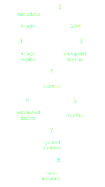
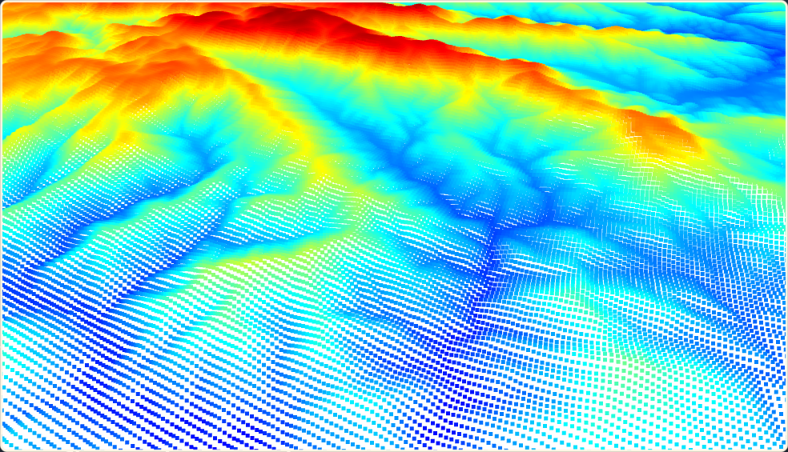
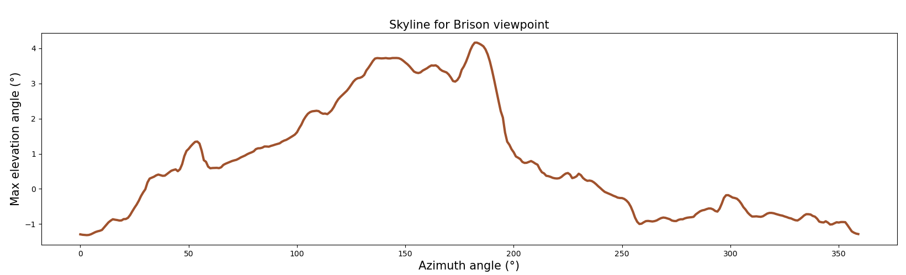
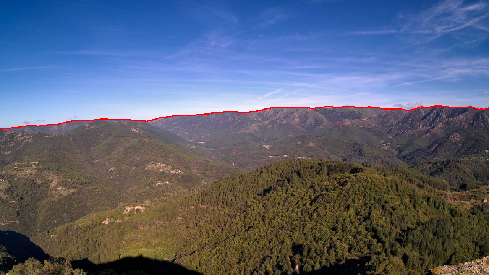
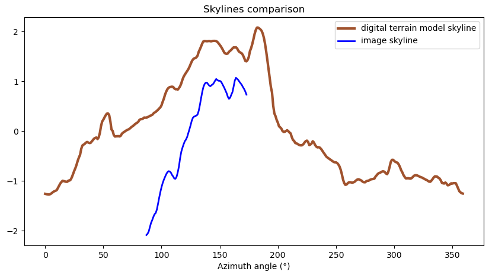
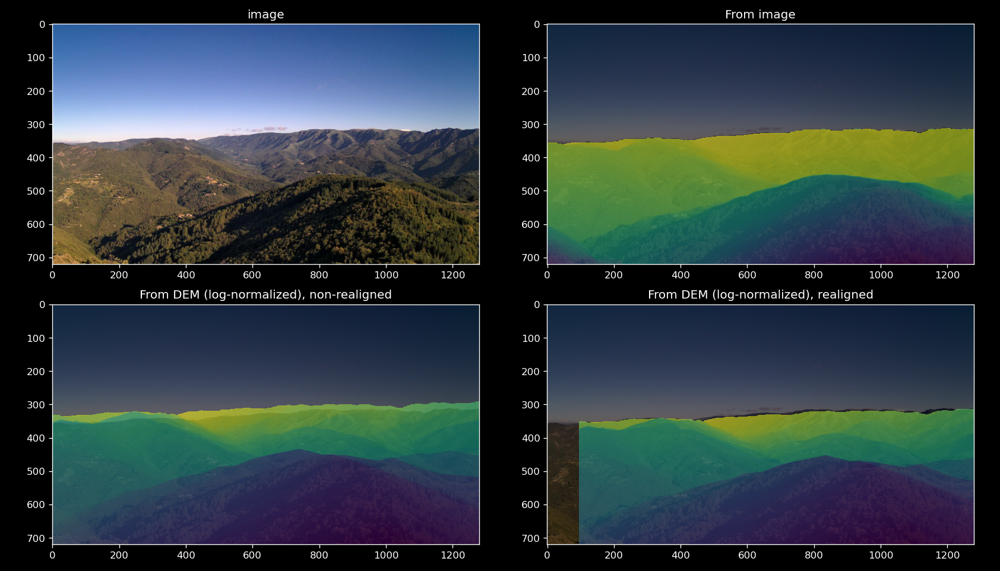

# Smoke localization
As soon as a suspicious smoke is detected, there is the need to precisely geolocate it, so the fire services can intervene quickly. The following tools aims to estimate a given point location from an image. 

## Try
1. Go to `georefcam/` and `horizon/` to install the packages. You can also find more details.   
2. Test the notebooks in `demo_notebooks/`.  

## Pipeline

1. Load Digital Elevation Model (DEM) from image location

2. Extract 360° skyline from viewpoint

3. Extract skyline from image (with Depth-Anything and filters)

4. Compare skylines and find best alignment, this corresponds to the camera azimuth.

5. Place a virtual camera in DEM at correct azimuth and generate depth map.

6. Estimate depths from images (Depth-Anything)

7. Correct the virtual camera by comparing the depths

8. Get the location of any point in the image
